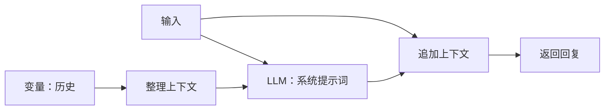

# 模型、绘图与智能体

更新日期：2026-10-09。

## 入口与保存

左侧主导航依次为创作、插件、模型、设置。模型从设置移出，侧栏提供 LLM 模型、Stable Diffusion 模型、Agent 三个集合。单击打开页面，右侧箭头或双击展开子项。每个连接、工作流和智能体都有稳定 ID，可创建、命名、编辑和删除。

连接、图、工具与 Agent 变量保存在 `workspace.json`，不写入世界 Markdown。旧 LLM 配置及 ID 保留，缺失的新集合初始化为空。API Key 默认隐藏输入，本地 JSON 目前没有额外加密。删除被引用的模型或工作流后，运行会报告失效引用。

## LLM 连接

使用 OpenAI 兼容接口，配置基础 URL、模型标识、密钥、启用状态。可单独覆盖模型列表和生成 URL；默认追加 `/models` 与 `/chat/completions`。基础 URL 通常需要包含服务的 `/v1` 路径。

基础 URL、列表 URL、密钥变化后，等待 800ms 自动获取模型目录；取消旧请求，避免旧结果覆盖新配置。支持手动刷新与手填 model，目录不支持或请求失败时仍可继续配置。目录接受 `data` 或 `models` 数组，按 ID 去重排序。

可选参数包括推理强度、Temperature、Top P、最大输出 Tokens、超时及附加请求 JSON。留空不发送，由服务默认值决定。最大输出 Tokens 使用 `max_completion_tokens`，仅支持 `max_tokens` 的服务可通过附加 JSON 配置。model、messages、stream 由调用器控制。推理强度是否支持取决于服务和所选模型。

“测试生成”会实际发送简短请求。错误显示 HTTP 状态与服务响应；当前为非流式生成。参数协议参考 [模型列表接口](https://developers.openai.com/api/reference/resources/models/methods/list) 和 [Chat Completions](https://developers.openai.com/api/reference/resources/chat/subresources/completions/methods/create)。

## 共用工作流编辑器

Agent 与 SD 使用同一节点画布。右侧操作树支持搜索、分类展开、点击添加与拖入节点。拖动节点标题移动，空白拖动画布，滚轮以光标为中心缩放，适配视图查看全图。位置、缩放保留在页面会话中。

点击输出端口，再点击输入端口创建连线；同一输入的新连接替换旧连接。双击输入端口断开，选择节点或连线后删除，Esc 取消连线。节点的本地参数用于未连接输入，已连接值优先。校验重复 ID、端口存在性、坐标、单输入多连线及循环；当前执行器是 DAG，不支持循环控制流。服务特定类型兼容性在执行/服务校验时报告。

运行时禁止编辑图。运行结果包括输出及成功节点轨迹；异常附带节点名称和具体错误。需要复杂程序逻辑时调用已有 JS/Python/Flow Function，避免把所有代码操作重新拆成卡片。

## Stable Diffusion / ComfyUI

每项是独立工作流，配置 ComfyUI URL、可选密钥和等待超时。默认地址为 `http://127.0.0.1:8188`。本程序提供工作流编辑器，ComfyUI 的 Python/GPU 执行环境仍需由用户启动。

加载 `/object_info` 后，右侧目录显示服务实际安装的官方和自定义节点，按节点 category 构建树。必选/可选输入、枚举、数字默认值及原生输出端口来自目录。可生成基础文生图模板，再选择 checkpoint 等值。

世界对象节点可读取类、实例或成员；Function 节点支持类型化调用。SD 中允许输入、常量、世界对象、算术、拼接、Function 作为前处理。它们先在 MyUniverse 内求值，把结果写入原生 Comfy 输入；原生节点间连接保留 `[节点 ID, 输出索引]`，绘图在 ComfyUI 执行。

支持导入/导出 MyUniverse 图，以及导入 ComfyUI **API 格式 JSON**；导入 API 图需要先加载节点目录，缺失节点会报错。普通 ComfyUI 前端含 `nodes` 的布局 JSON 尚不支持，也没有嵌入完整官方前端。API 导出求值前处理后生成可提交的 prompt。

提交 `/prompt`，轮询 `/history/{id}`，从 `/view` 读取并显示图片；需要 SaveImage 等产生图片输出的节点。服务执行错误、缺失必选输入、超时和无图片结果均有明确反馈。接口依据 [ComfyUI 服务路由](https://docs.comfy.org/development/comfyui-server/comms_routes)。停止等待不会调用全局 interrupt，以免终止同一服务中其他任务；已提交任务可能继续执行。

## Agent：显式上下文与变量

节点包括输入、返回、文本/JSON 常量、世界对象、算术、拼接、Function、LLM、SD、HTTP Tool、变量读取/写入、整理上下文、追加上下文。Agent 要有且只有一个返回节点；只计算输出依赖的节点，每个节点一次运行只求值一次。

LLM 节点选择注册的模型，配置系统提示词，接受 prompt 与可选 context，返回字符串。它不自行保存历史。上下文是 `{role, content}` 数组，通过变量和专用节点显式管理；整理上下文负责限制条数，追加节点把本次输入与回复写回历史。编辑页提供上下文示例图。

变量声明使用初始 JSON；运行内复制变量，按世界 ID 保存独立记忆，无世界时使用 global。成功才提交变量，失败不提交本次修改。外部模型请求、工具调用和绘图已经产生的效果无法回滚。需要执行顺序时连接 `after` 依赖，不能依赖画布位置或数组顺序。

世界对象节点通过稳定类/实例/成员 ID 读取当前运行快照，支持 Markdown、原生值、程序 TypedValue 输出。Function 节点复用现有执行器；v2 传入所选实例 self 和类型化 input，已有 TypedValue 保持类型，普通输入转换为 Text。程序类型不等同于 JS 原生对象，详见 [Function](functions.md)。

## Tool 与聊天

插件的工具集合支持 HTTP Tool 注册、嵌套文件夹、URL、GET/POST、密钥、请求体模式、启停和删除。Agent Tool 节点选择已注册工具，也可配置内联请求。删除/停用工具后引用会报错；当前工具为 HTTP JSON 调用，不提供任意本地命令执行。

聊天输入区可选择启用的 LLM 或 Agent。发送与等待由 AppRoot 管理，切页、切会话后仍把结果写回原始世界/会话，避免回复进入新页面。请求失败保留用户消息并显示错误；支持停止等待。Agent 回复暂按文本/JSON显示，SD 页提供图片展示。Agent 历史由工作流变量控制，不自动使用聊天消息作为隐藏记忆。

## 网络与验证边界

浏览器使用 fetch，跨域由目标服务 CORS 决定。桌面通过 Tauri reqwest 网络桥请求，允许 HTTP/HTTPS、Bearer 鉴权，禁止 URL 内凭据和重定向；超时上限 600 秒，响应上限 32MB，图片检查 MIME。停止等待可取消浏览器请求；原生/远端请求可能继续至超时。

本阶段 `npm test` 63 项通过，Rust release 12 项通过，覆盖图校验、前处理、模型发现/生成、显式上下文、变量提交、工具引用、Function 类型和世界隔离。网络测试使用模拟响应与真实本地回环服务，不使用用户密钥。本机默认端口 ComfyUI 未响应，尚未验证真实 GPU 出图及用户服务生成；构建成功不能代替服务验收。

前端与桌面构建通过，正式同名 exe 和根目录快捷方式已更新。浏览器验证了独立模型导航、三类集合、设置仅保留主题，以及临时内存页面的画布连线修改和输入到返回的执行结果，未创建持久化测试模型/世界。

尚未实现流式输出、Agent 循环/协作调度、完整 ComfyUI 布局导入、自动插图归档与章节自动写作。

## 编辑工作区优先（2026-10-09）

文件夹/集合列表使用完整 page-heading 与 heading-actions 展示集合名称及新建入口。进入具体绘画工作流、Agent 或 Function 后，不再重复占据大块空间的标题、说明和创建按钮。顶部使用 48px 紧凑工具栏标识当前对象，导入/导出等操作为辅助；主区域无居中宽度限制和外围留白，画布或源码编辑器填满剩余高度与宽度。

配置、初始变量、接口规范及测试输入/结果通过“配置”和“运行/测试”打开右侧覆盖面板，默认关闭，不挤压画布。两个面板互斥，运行结果/异常可查看；辅助面板可独立滚动。对象调用助手和节点库保留在编辑区边侧。文件夹列表保留新建功能，具体编辑页提供精简动作，右键菜单继续复用当前真实工具栏。

这个规则强调当前任务的主操作载体：用户进入工作流是为了编排节点，进入函数是为了写代码，标题和说明应让位给这些操作；无需将所有页面统一套用列表页的标题布局。

## 统一顶栏与画布工具栏（2026-10-09）

所有画布区域禁止选择卡片标题、说明、标签和地图文字，防止拖动/框选时出现文字选区；输入框、文本域和可编辑内容仍可正常选中文本。模型侧栏根文件夹采用与插件相同的 13px/600，子项 12px/400，避免名称旁有计数时被 CSS last-child 规则漏掉。

页面 heading-actions 的动作在主界面顶栏显示为带图标、悬停提示的按钮，位置在固定 Markdown 分页按钮左侧。打开 Markdown 时，该动作组随源码列宽度渐变向左移动，分页按钮仍固定最右。非文件夹页隐藏原 heading-actions；文件夹页保留原按钮组，同时提供顶栏入口。顶栏调用原按钮，复用禁用、开关、导入和确认行为，避免产生两套操作实现。

绘画、Agent 与 Function Flow 只保留一条画布工具栏：配置、运行/测试、适应画布与删除所选在这条栏中。导入、导出、删除文件等页面级操作移到主界面顶栏。脚本编辑器保留紧凑配置/测试栏。右键菜单继续读取真实页面操作，包括新画布工具栏。

### 工作流节点库与选择（2026-10-09）

Agent、SD 与 Function Flow 的配置、运行/测试按钮和其他画布动作统一排列在工具栏右侧。节点库采用关系网详情面板相同的 310px 右侧覆盖面板，从工具栏顶部开始，标题与工具栏并排；PanelRightOpen/PanelRightClose 控制展开收起，位移和透明度渐变，关闭时禁止交互，展开状态按页面记忆。工具栏为展开面板留出位置，画布本身保持全区域。

空白按下后以 5px 位移阈值区分点击与拖动：点击清除节点/连线选择并取消待连线，拖动画布保留选择；节点与连线的事件不作为空白点击。浏览器已验证空白点击清除选择、拖动视角保留选择及节点库收起。

## 严格类型变量与结构化上下文（2026-10-09）

新的节点库不再提供 ANY 读变量/写变量两个卡片，而是五种具体类型的统一读写节点。Messages 保留工具调用与配对结果；LLM 新增 messages 命名输出，文本 value 继续兼容。Image 使用版本化资源结构，提供读取属性、SD 结果桥接、显示、保存节点。初始变量与成功运行记忆通过 {type,value} 声明身份；旧卡片提供显式类型迁移。完整规范与编排示例见 [workflow-types.md](workflow-types.md)。

## 工作流运行观察与变量池（2026-10-09）

执行状态独立于持久化图定义：节点依次发出 waiting、running、complete，异常标记 error，取消标记 cancelled。运行面板将当前执行节点高亮；每条实际经过的连线记录本次输出及实际类型，显示紧凑摘要，悬停查看完整值。观察事件使用副本，不能改变程序数据。编辑器播放在节点开始时短暂停留，普通调用不附加展示延迟。

变量池维护 `{id,type,value}` 类型信封。id 是稳定身份，name 是可编辑的索引；节点通过下拉列表选择兼容类型的变量。新建、改名、改类型、初始值编辑和绑定节点修改纳入同一撤销快照。改名同步节点绑定以及各世界的 Agent memory；改类型同步 value 端口，兼容值保留，不兼容值恢复类型默认值。连接保留，运行校验提示不兼容类型。旧的原生值可以推断基础类型，无法推断的对象需明确指定类型。

运行使用工作副本，变量池实时显示变量写入结果；成功后提交 Agent 记忆，失败或取消不提交临时值。变量池显示最近运行值时，初始值编辑仍明确标注，避免混淆。运行中禁用图定义与变量编辑，保留平移、缩放、查看完整值及面板开关。

ComfyUI 原生节点的执行通过 WebSocket 按 prompt_id 过滤，桌面端使用原生连接并通过 Tauri 事件桥接，支持 Bearer 认证。浏览器使用 WebSocket。原生 ComfyUI 公开事件不包含所有 Tensor 的实际值，因此对应连线显示“服务端数据 · 类型”；不会编造 Tensor 数值。宿主节点的值正常展示。事件通道不可用时提示并继续 HTTP history 查询。真实模型与 GPU 联调仍需要实际服务。

节点库与变量池都采用固定 header 加独立滚动内容区。节点库标题、收起按钮和工具栏保持顶边对齐，滚动只作用于搜索与分类列表；此结构同步用于 Function Flow。变量池位于画布右下方，可用分页按钮滑动收起。

最新图标规范覆盖早期方案：模型入口 Sparkles，插件 Puzzle；LLM 使用与模型项一致的 Bot，SD 项及节点使用 SquareSparkles，工具独立分类 Wrench；String 为 Letters，Boolean 为 Binary，其他变量类型 ScanBox，方法 FileCodeCorner，属性 FileBox。缺少的 Lucide 图标使用本地官方 SVG 与 ISC 授权，无运行时下载。
